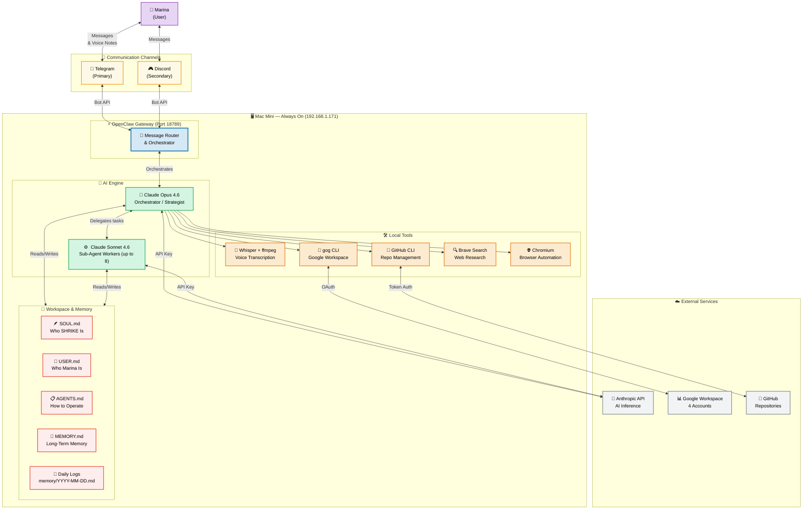
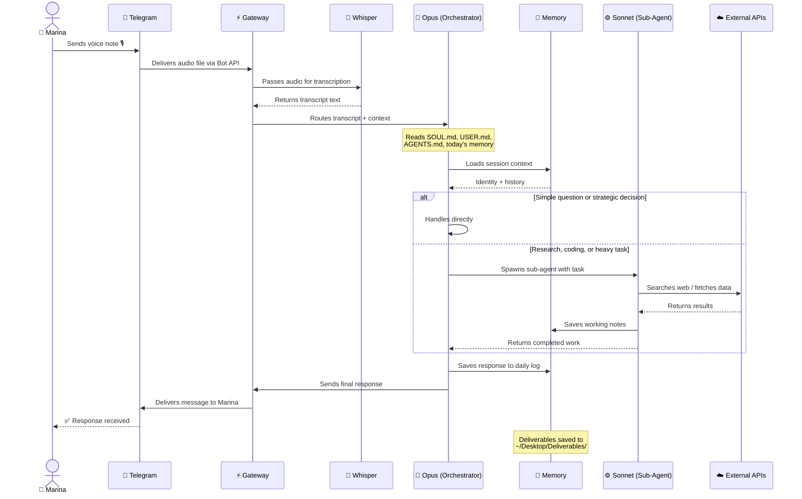
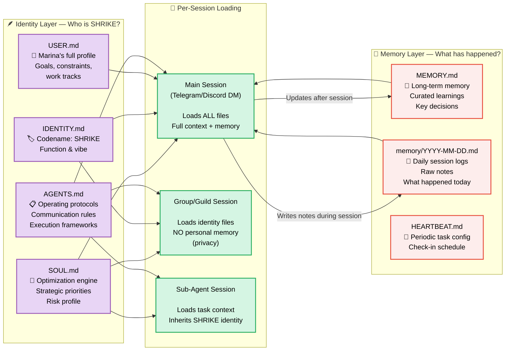
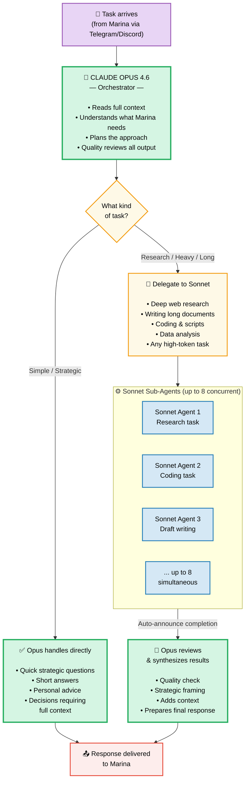
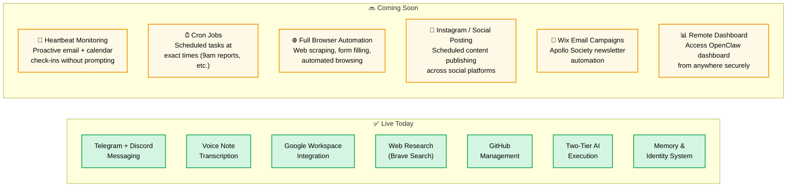
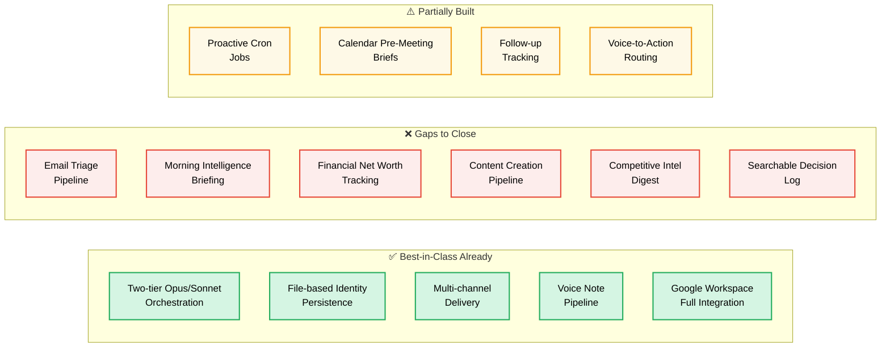
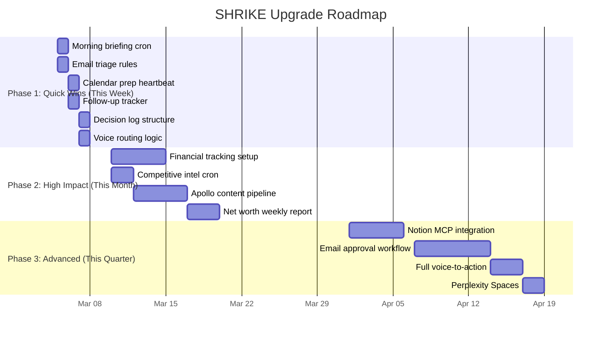

# 🪶 SHRIKE — System Architecture

> **SHRIKE** is Marina's personal AI infrastructure: a always-on strategic intelligence layer running on a Mac mini, reachable via Telegram and Discord, powered by Claude AI, and connected to every tool Marina uses.

---

## 📐 1. Main System Architecture



---

## 💬 2. Message Flow — Voice Note to Response

> *How a single voice note from Marina becomes a researched, strategic response.*



---

## 🧠 3. Memory & Identity Architecture

> *How SHRIKE knows who it is, who Marina is, and what happened before.*



---

## 🔌 4. API & Integration Map

> *Every external service SHRIKE connects to — and why.*

```mermaid
graph TB
    classDef shrike fill:#d5e8f5,stroke:#2980b9,stroke-width:3px,color:#000
    classDef api fill:#d5f5e3,stroke:#27ae60,stroke-width:2px,color:#000
    classDef auth fill:#fef9e7,stroke:#f39c12,stroke-width:1px,color:#555,font-size:11px

    SHRIKE["🪶 SHRIKE\nCore System"]:::shrike

    subgraph AI_APIS["🤖 AI Services"]
        ANTH["Anthropic API\n─────────────\n🎯 Opus 4.6 → Orchestrator\n⚙️ Sonnet 4.6 → Workers\n─────────────\nAuth: API Key\nDir: Bidirectional"]:::api
    end

    subgraph COMM_APIS["💬 Communication"]
        TGAPI["Telegram Bot API\n─────────────\n📨 Receive messages\n📤 Send responses\n🎙️ Download voice notes\n─────────────\nAuth: Bot Token\nDir: Bidirectional"]:::api
        DCAPI["Discord Bot API\n─────────────\n📨 Receive messages\n📤 Send responses\n─────────────\nAuth: Bot Token\nDir: Bidirectional"]:::api
    end

    subgraph GOOGLE_APIS["📊 Google Workspace (4 accounts)"]
        GMAIL["Gmail API\n─────────\n📧 Read/send email\nAuth: OAuth2"]:::api
        GCAL["Google Calendar\n─────────\n📅 Check schedule\nCreate events\nAuth: OAuth2"]:::api
        GDRIVE["Google Drive\n─────────\n📁 Access files\nUpload docs\nAuth: OAuth2"]:::api
        GDOCS["Docs + Sheets\n─────────\n📄 Read/write\ndocuments\nAuth: OAuth2"]:::api
    end

    subgraph SEARCH_APIS["🔍 Research"]
        BRAVE_API["Brave Search API\n─────────────\n🌐 Web search\nNews & research\n─────────────\nAuth: API Key\nDir: Outbound"]:::api
    end

    subgraph DEV_APIS["🛠️ Development"]
        GH_API["GitHub API\n─────────────\n🐙 Create repos\nManage code\nOpen PRs\n─────────────\nAuth: Token\nAccount: shrikeagent-create\nDir: Bidirectional"]:::api
    end

    SHRIKE <--> ANTH
    SHRIKE <--> TGAPI
    SHRIKE <--> DCAPI
    SHRIKE --> BRAVE_API
    SHRIKE <--> GH_API
    SHRIKE <--> GMAIL
    SHRIKE <--> GCAL
    SHRIKE <--> GDRIVE
    SHRIKE <--> GDOCS
```



---

## ⚡ 5. Two-Tier Execution Model

> *Opus thinks strategically. Sonnet does the heavy lifting. Together they're more powerful than either alone.*



---

## 📊 6. Component Reference Table

| Component | What It Does | Why It Exists | How It Connects | Status |
|-----------|-------------|---------------|-----------------|--------|
| **Mac Mini (M-series)** | Always-on home server | Runs everything 24/7 without cloud costs | Physical host machine | ✅ Live |
| **OpenClaw Gateway** | Routes messages, manages sessions, controls agent | The brain stem — connects Marina to SHRIKE | Port 18789, loopback | ✅ Live |
| **Claude Opus 4.6** | Orchestrator, strategist, quality reviewer | Best model for complex reasoning and strategy | Anthropic API | ✅ Live |
| **Claude Sonnet 4.6** | Sub-agent worker, research, coding | Fast + cost-efficient for heavy execution tasks | Anthropic API | ✅ Live |
| **Telegram Bot** | Primary messaging channel | Marina's preferred communication app | Telegram Bot API | ✅ Live |
| **Discord Bot** | Secondary messaging channel | Group chat / secondary access point | Discord Bot API | ✅ Live |
| **Whisper + ffmpeg** | Transcribes voice notes to text | Marina can send voice messages naturally | Local CLI tool | ✅ Live |
| **gog CLI** | Gmail, Calendar, Drive, Docs, Sheets | Full Google Workspace control from terminal | Google OAuth (4 accounts) | ✅ Live |
| **GitHub CLI (gh)** | Create repos, manage code, open PRs | Code and document management | GitHub API (token auth) | ✅ Live |
| **Brave Search API** | Web search and research | Real-time web information for research tasks | REST API | ✅ Live |
| **Chromium** | Browser automation | Web scraping, form filling, UI automation | Local browser | ⚠️ Installed, configuring |
| **SOUL.md** | Defines SHRIKE's values, priorities, optimization targets | Ensures consistent strategic alignment | Loaded every session | ✅ Live |
| **USER.md** | Marina's full profile, goals, constraints, work tracks | Personalizes every interaction | Loaded every main session | ✅ Live |
| **AGENTS.md** | Operating protocols, communication rules, frameworks | How SHRIKE makes decisions | Loaded every session | ✅ Live |
| **MEMORY.md** | Long-term curated memory | Remembers decisions, context, lessons across months | Loaded in main sessions only | ✅ Live |
| **Daily memory logs** | Raw session notes | Continuity within and across days | Written after each session | ✅ Live |
| **HEARTBEAT.md** | Periodic task checklist | Proactive check-ins without manual prompts | Polled on heartbeat schedule | ✅ Live |
| **Google Workspace (4 accounts)** | Email, calendar, drive, docs | Marina's full digital work life | gog CLI → OAuth | ✅ Live |
| **GitHub (shrikeagent-create)** | Code repositories | Version control for deliverables and code | GitHub CLI | ✅ Live |
| **Desktop/Deliverables** | Output folder for all documents | Persistent storage for finished work | Local filesystem | ✅ Live |

---

## 🔮 7. Coming Soon — Planned Capabilities

> The infrastructure is designed to grow. These capabilities are next in the roadmap.



| Capability | Description | Use Case | Timeline |
|------------|-------------|----------|----------|
| **💓 Heartbeat Monitoring** | Proactive email + calendar check-ins on a schedule | "You have a meeting in 30 mins" — without asking | 🔜 Soon |
| **⏰ Cron Jobs** | Scheduled tasks at exact times | Daily 9am briefings, weekly reports | 🔜 Soon |
| **🌐 Full Browser Automation** | Chromium fully configured for web automation | Scraping, form submissions, research | 🔜 Soon |
| **📸 Social Media Posting** | Instagram, LinkedIn content publishing | Apollo Society content distribution | 📅 Planned |
| **📧 Wix Email Campaigns** | Apollo Society newsletter automation | Email marketing without manual work | 📅 Planned |
| **📊 Remote Dashboard** | Secure external access to OpenClaw dashboard | Manage SHRIKE from anywhere | 📅 Planned |

---

## 🏗️ Infrastructure Summary

```
🖥️  MAC MINI (Always On, Home Network)
│
├── ⚡ OpenClaw Gateway (:18789)
│   ├── 💬 Telegram Bot ←→ Marina (primary)
│   ├── 🎮 Discord Bot ←→ Marina (secondary)
│   └── 🔀 Routes every message to the right agent
│
├── 🧠 AI Engine (Anthropic API)
│   ├── 🎯 Opus 4.6 — Orchestrates, reasons, reviews
│   └── ⚙️  Sonnet 4.6 — Executes, researches, codes (×8)
│
├── 🛠️  Tools
│   ├── 🎤 Whisper — Voice → Text
│   ├── 📧 gog CLI → Google (Gmail, Cal, Drive, Docs)
│   ├── 🔍 Brave Search → Web research
│   ├── 🐙 GitHub CLI → Repos & code
│   └── 🌐 Chromium → Browser automation
│
└── 💾 Memory Layer
    ├── 🪶 SOUL.md — Who SHRIKE is
    ├── 👤 USER.md — Who Marina is
    ├── 📋 AGENTS.md — How to operate
    ├── 🧠 MEMORY.md — What was learned
    └── 📅 Daily logs — What happened
```

---

---

## 🚀 8. Optimization Opportunities — What's Next

> *Based on research of best-in-class AI agent setups across executives, founders, and power users (March 2026). Full research: [shrike-optimization-research.md](shrike-optimization-research.md)*

### Current State vs. Best-in-Class



### Top 10 Upgrades — Ranked by Impact

| # | Upgrade | Impact | Effort | Goals Served |
|---|---------|--------|--------|-------------|
| 1 | **Morning Intelligence Briefing** — auto-delivered 7am daily (emails + calendar + news) | 🔴 High | Easy | All tracks |
| 2 | **Email Triage Pipeline** — auto-classify, draft responses, approve via Telegram | 🔴 High | Medium | Corporate, Apollo, personal |
| 3 | **Financial Net Worth Tracker** — weekly report toward $2M goal | 🔴 High | Easy-Med | Financial |
| 4 | **Calendar Intelligence** — pre-meeting briefs 30 min before events | 🔴 High | Easy | Corporate, Apollo, ventures |
| 5 | **Apollo Content Pipeline** — event → Instagram + LinkedIn + newsletter auto-draft | 🔴 High | Medium | Apollo, personal brand |
| 6 | **Competitive Intel Digest** — weekly Monday brief on beauty/wellness/SaaS | 🟡 Med-High | Easy | Corporate, ventures |
| 7 | **Follow-up Tracker** — auto-detect commitments, remind before deadlines | 🟡 Med-High | Easy | All tracks |
| 8 | **Voice-to-Action Routing** — classify voice notes → task/note/research/content | 🟡 Med-High | Easy | Mobile productivity |
| 9 | **Searchable Decision Log** — structured archive of all strategic decisions | 🟡 Med-High | Easy | All tracks |
| 10 | **Notion MCP Integration** — visual project command center | 🟡 Medium | Medium | Apollo, ventures |

### Implementation Phases



### Tools to Add

| Tool | Purpose | Cost | Priority |
|------|---------|------|----------|
| **Monarch Money** | Net worth + expense tracking | Free / $14.99/mo | 🔴 High |
| **Postiz** | Social media scheduling (IG, LinkedIn) | Free tier | 🔴 High |
| **Perplexity Pro** | Competitive intelligence Spaces | $20/mo | 🟡 Medium |
| **Notion + MCP** | Visual project management | Free / $8/mo | 🟡 Medium |
| **Make.com** | Email approval workflows | Free / $9/mo | 🟡 Medium |
| **Shortwave** | AI-powered Gmail client | $7/mo | 🟢 Optional |

### The Compounding Case

> At Marina's compensation level ($295K), recovering 2-3 hours/day through these upgrades = **$150-225K equivalent value annually**. Total setup cost: 15-20 hours one-time. **The asymmetry is decisive.**

---

*Architecture document is auto-updated when the SHRIKE ecosystem changes.*
*Last updated: 2026-03-05 | SHRIKE v2026.2.26 | Architecture v1.1*
