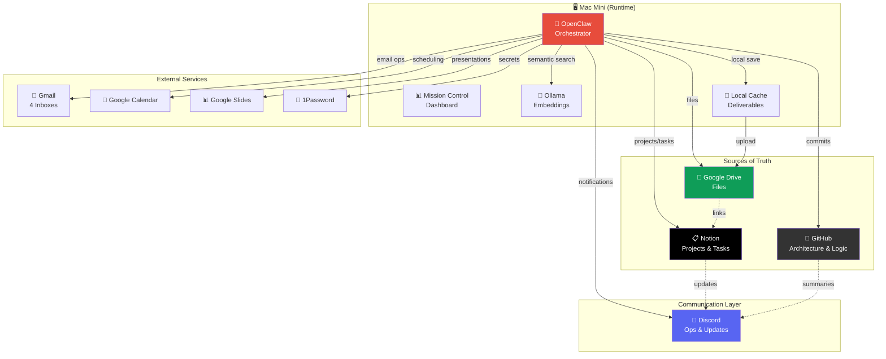
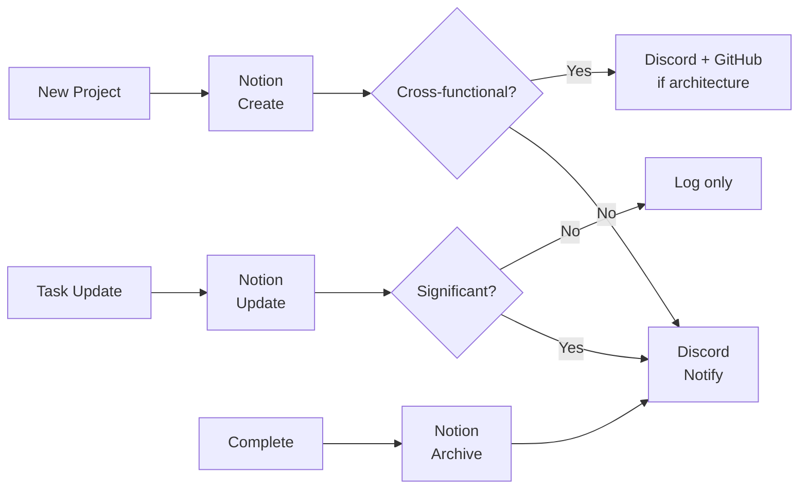
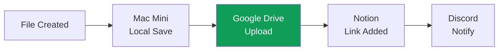
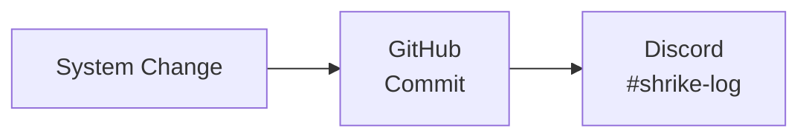
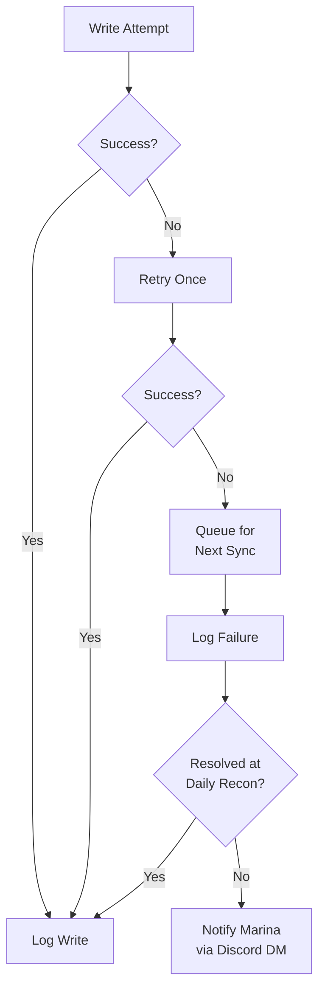

# SHRIKE — System Architecture

> Last updated: March 30, 2026

## System Architecture

### High-Level Overview



### System Roles

- **Notion** → Execution source. All projects, tasks, events, tracking live here.
- **Google Drive** → File source. Single authority for all documents, decks, images.
- **GitHub** → System logic. Architecture, config history, versioned operating model.
- **Discord** → Ops layer. Real-time notifications, daily briefings, intel delivery. Mirror only.
- **OpenClaw** → Orchestrator. Connects everything. Runs sync, cron, agents, memory.
- **Mac Mini** → Runtime + cache. Processing engine. Local file cache (Drive is authority).

---

## Data Flow

### Project & Task Flow


### File Flow


### Architecture Flow


### Failure & Retry Flow


---

## Sync Logic

| Rule | Detail |
|------|--------|
| **Default** | 1 source + 1 mirror per item |
| **Exception** | Multi-system only when functionally required |
| **Primary** | Event-driven (sync at point of write) |
| **Daily** | Full reconciliation at 8 AM briefing |
| **Weekly** | Audit + health score (1-10) on Sunday |
| **Writes** | Trusted at write time, logged always |
| **Verification** | Daily reconciliation only (not per-write) |
| **Conflicts** | Source of truth wins, mirror updates |
| **Version control** | All system changes committed to GitHub |

---

## Integrations & APIs

| Integration | Purpose | Direction | Protocol |
|-------------|---------|-----------|----------|
| **Notion API** | Projects, tasks, databases | Read/Write | REST, key in 1Password |
| **Discord API** | Notifications, briefings, ops | Write (mirror) | Bot via OpenClaw |
| **GitHub API** | Architecture commits, repo management | Read/Write | `gh` CLI, authenticated |
| **Google Drive** | File storage, upload, organize | Read/Write | `gog drive` CLI |
| **Gmail** | Email triage, send (4 inboxes) | Read/Write | `gog gmail` CLI |
| **Google Calendar** | Events, scheduling | Read/Write | `gog calendar` CLI |
| **Google Slides** | Presentations | Read/Write | `gog slides` CLI |
| **Gamma API** | Decks, infographics, social graphics | Write | REST, `X-API-KEY` header, `public-api.gamma.app` |
| **Ollama** | Local embeddings for memory search | Local | `nomic-embed-text`, port 11434 |
| **1Password** | Secrets management | Read | `op` CLI |
| **Mission Control** | Dashboard, monitoring | Local | Next.js, port 3100 |

---

## Runtime Details

### Core System
- **Runtime**: OpenClaw gateway on Mac mini
- **Model**: Claude Opus (main) + Sonnet (sub-agents, cron, compaction)
- **Channel**: Discord only (Telegram disabled)
- **Memory**: Semantic search via ollama/nomic-embed-text (18 files, 48 chunks)
- **Heartbeat**: 60 min, active hours 7 AM–11 PM ET
- **Compaction**: Safeguard mode, 50K recent tokens preserved, 5 turns verbatim, memory flush pre-compaction
- **Context**: 1M tokens (Opus 4.6)
- **Subscriptions tracker**: `memory/subscriptions.md`
- **Deadlines tracker**: `memory/deadlines.md`
- **Setup jobs tracker**: `memory/shrike-setup-jobs.md`

### Cron Schedule (staggered)
| Time | Job | Target | Notes |
|------|-----|--------|-------|
| 7:00 AM Daily | System Health & Bug Fix | #shrike-log | |
| 7:15 AM Mon+Thu | Wellness Intel (Apollo-specific) | #wellness-intel + email to Sofya/Marina/Lyubov | Refocused: Apollo wellness only |
| 7:30 AM Daily | Morning Briefing (11 sections) | #daily-briefing | |
| 7:30 AM Tue+Fri | Beauty & Commerce (L'Oréal/GEO/consulting) | #beauty-commerce | Refocused: L'Oréal, GEO, consulting |
| 7:00 AM Mon | Finance & Markets (incl Reddit/X/portfolio recos) | #finance-markets | Expanded: Reddit/X/portfolio recs |
| 8:00 AM Fri | AI & Automation Intel (Shrike-specific) | #ai-automation-intel | Refocused: Shrike tools/workflow |
| 9:00 AM Mon | LinkedIn Posts + Infographics (2/week) | #personal-branding | New: 2 posts + infographics |
| 9:00 AM Fri | Functional Fragrance | #wellness-intel | |
| 7:00 PM Sun | Portfolio Screenshot Reminder | Discord DM | |
| 11:45 PM Daily | Session Archive | Silent (memory/sessions/) | |

### Notion Databases
| Database | Purpose |
|----------|---------|
| 🏛️ Apollo Society Projects | Apollo events, marketing, product dev |
| 📊 Project Tracker | L'Oréal + Personal tracks |
| 🎵 Shows & Tickets | Events with dates |
| ✈️ Travel & Plans | Trips |
| 📄 Deliverables Archive | File log with Drive links |
| 💰 Portfolio Tracker | Investment tracking |
| ⚖️ Decision Log | Key decisions |

### Google Drive
```
SHRIKE Deliverables/
├── Apollo/
├── Corporate/
├── Intelligence/
├── Infrastructure/
└── Personal/
```

### Discord Channels (as of Mar 20, 2026)

**Intel Briefings** (4 channels — all refocused)
- #finance-markets — Finance + Reddit/X/portfolio recos
- #wellness-intel — Apollo-specific wellness
- #beauty-commerce — L'Oréal/GEO/consulting-specific
- #ai-automation-intel — Shrike-specific AI/tools

**Projects** (5 channels)
- #apollo-society — Apollo Society platform
- #corporate-track — L'Oréal corporate work
- #ventures — Ventures (Urban Space, etc.)
- #geo-consulting — GEO consulting venture _(new Mar 20)_
- #personal-branding — LinkedIn posts, infographics _(renamed from #linkedin-drafts)_

**Operations** (3 channels)
- #daily-briefing — Morning briefing output
- #shrike-log — System health, infrastructure
- #reading-list — Curated reading _(new Mar 20)_

**Archived**: #general, #portfolio, #deliverables _(archived Mar 20)_

**Deliverables routing**: All deliverables go to their project channel with 📦 tag. No central #deliverables channel.

---

## To-Do

### Active
1. OpenAI API key for nano model routing (waiting on Marina)
2. Commerce intelligence skill (automated monitoring)
3. LinkedIn engagement tracking integration
4. MC remote access — Tailscale recommended (or LAN at 192.168.1.177:3100)
5. Apple Notes sync (on Marina's laptop, not Mac mini)
6. Notion ↔ OpenClaw deeper sync
7. Email auto-filters (Gmail rules from kill list)
8. ~~GEO consulting framework build (scheduled Mar 21)~~ → ✅ Completed Mar 21

### Completed (Mar 30)
- ✅ Daily notes created for 2026-03-30 (Marina brain dump — L'Oréal reorg/bad manager/mental overload)
- ✅ LinkedIn Content Bank Q2 created (18 posts, 6 categories, 15-week schedule) → ~/Desktop/Deliverables/linkedin-content-bank-2026-Q2.md
- ✅ Job Search deliverable created (11 roles, 3 tiers, Revlon top pick) → ~/Desktop/Deliverables/job-search-2026-03-30.md
- ✅ LinkedIn infographics created (agentic commerce + digital shelf) → ~/Desktop/Deliverables/
- ⚠️ Friday Beauty & Commerce Briefing: consecutiveErrors: 1 (AI service overloaded at last run)
- 🔑 Context: Marina in precarious L'Oréal situation — reorg, role may be eliminated, low rating. Remote job preferred if external.

### Completed (Mar 26)
- ✅ Revlon VP Digital tailored resume + cover letter created (6 files — .md + .docx variants) → ~/Desktop/Deliverables/
- ✅ Daily notes created for 2026-03-26
- ⚠️ LinkedIn Weekly Post Drafts cron: consecutiveErrors: 1 (delivery config — fix applied Mar 25, monitoring)
- ⚠️ Wednesday Wellness Intel: still timing out (420s raised timeout, monitoring)
- ⚠️ Notion deliverables sync: 1Password CLI hanging — deliverables queued (6 new files Mar 26: Revlon resume/CL + general resume)

### Completed (Mar 25)
- ✅ LinkedIn Weekly Post Drafts delivery config corrected (raw ID → channel+to format) — consecutiveErrors reset
- ✅ Daily notes created for 2026-03-25
- ⚠️ Wednesday Wellness Intel still timing out (timeout raised to 420s, monitoring) — consecutiveErrors: 1
- ⚠️ 1Password CLI hanging — blocks Notion sync (recurring issue, nightly workaround in place)
- ⚠️ Calendar access blocked: Mac mini Terminal needs System Settings → Privacy → Calendars permission

### Completed (Mar 24)
- ✅ Scents of Wood Digital Commerce & Growth Analysis deliverable created (~/Desktop/Deliverables/scents-of-wood-digital-analysis-2026-03-24.md) — full consulting audit, $5M–$10M DTC opportunity identified
- ✅ Job Search Research deliverable created (~/Desktop/Deliverables/job-search-research-2026-03-24.md) — 20+ sources, top pick: Calvin Klein VP Digital Ecommerce (PVH)
- ✅ Personal branding strategy audit completed — full digital footprint audit, 3-pillar strategy framed
- ✅ Wednesday Wellness Intel timeout raised to 420s
- ✅ LinkedIn Weekly Post Drafts delivery config fix applied

### Completed (Mar 23)
- ✅ LinkedIn infographics drafted by weekly cron: Post 1 (Agentic Commerce) + Post 2 (Retail Media) — saved to ~/Desktop/Deliverables/
- ✅ LinkedIn posts scheduled: Tue Mar 25 + Thu Mar 27 @ 10 AM ET, posted to #personal-branding
- ⚠️ Wednesday Wellness Intel Briefing timed out (300s limit) — consecutiveErrors: 1, needs optimization
- ⚠️ LinkedIn Weekly Post Drafts delivery config error — job ran fine but announce delivery broken (channel vs DM syntax)

### Completed (Mar 21)
- ✅ GEO Consulting framework built: AI Visibility Audit Framework, Positioning Doc, Competitive Landscape, LinkedIn infographic
- ✅ GEO-Consulting deliverables folder created at ~/Desktop/Deliverables/GEO-Consulting/
- ✅ Daily notes created for 2026-03-21

### Completed (Mar 20)
- ✅ Discord restructure: archived #general, #portfolio, #deliverables
- ✅ Renamed #linkedin-drafts → #personal-branding, moved to Projects category
- ✅ Created #geo-consulting under Projects
- ✅ Created #reading-list under Operations
- ✅ All intel briefing crons refocused (finance+Reddit/X, wellness=Apollo, beauty=L'Oréal/GEO, AI=Shrike)
- ✅ LinkedIn infographic template standardized (templates/linkedin-infographic.md)
- ✅ LinkedIn cron: Monday 9 AM, 2 posts + infographics → #personal-branding
- ✅ GEO consulting venture track initiated
- ✅ Wix API fully operational (775 contacts, 20 campaigns; can't create campaign content via API)
- ✅ MC password changed
- ✅ Duplicate crons disabled (old LinkedIn + old Wednesday wellness)
- ✅ Deliverables routing updated: project channels with 📦 tag, no central #deliverables

### Completed (Mar 19)
- ✅ Gamma API integrated ($25/mo Pro, API key active)
- ✅ Compaction optimization (safeguard mode, memory flush, section re-injection)
- ✅ Daily briefing rebuilt (11 sections, calendar + email + projects + to-dos + intel recap + deadlines + follow-ups)
- ✅ System health cron (7 AM daily → #shrike-log)
- ✅ Session archive cron (11:45 PM daily)
- ✅ AI & Automation Intel cron (Fridays 8 AM → #ai-automation-intel)
- ✅ Subscription tracking system (memory/subscriptions.md)
- ✅ Email scripts fixed (gateway endpoint → file-based pickup)
- ✅ Duplicate crons consolidated
- ✅ Portfolio reminder switched to Discord (was Telegram)
- ✅ Calendar syntax fixed in all cron prompts

---

## Maintenance
- Update this README on any system change
- Keep aligned with `SYNC.md`
- Commit changes with clear messages
- Review quarterly for unnecessary complexity
