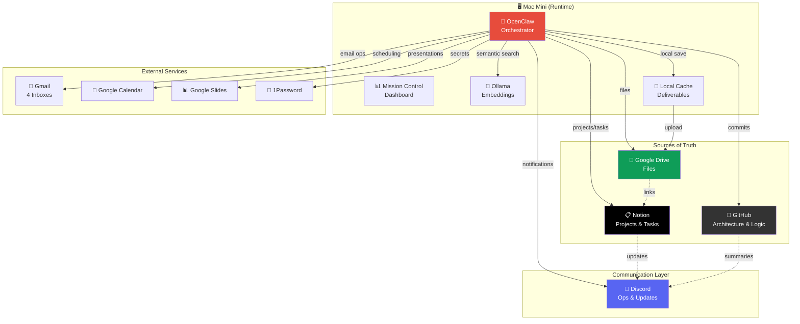
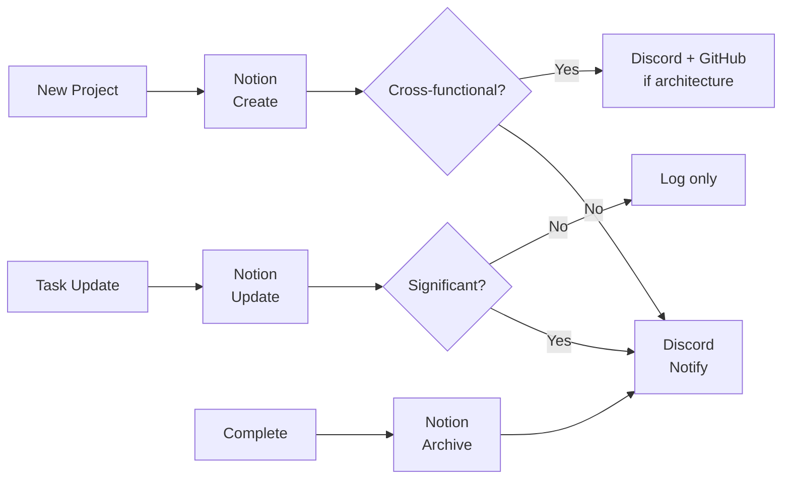
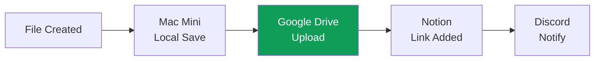
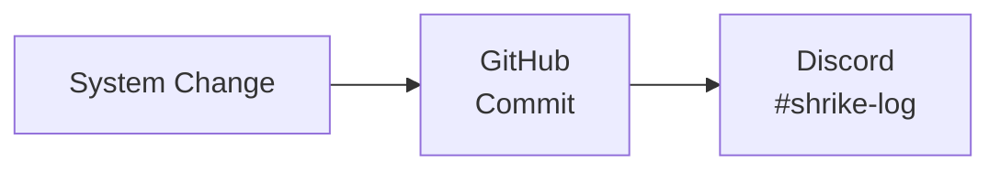
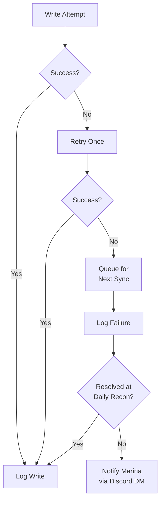

# SHRIKE — System Architecture

> Last updated: March 19, 2026

## System Architecture

### High-Level Overview



### System Roles

- **Notion** → Execution source. All projects, tasks, events, tracking live here.
- **Google Drive** → File source. Single authority for all documents, decks, images.
- **GitHub** → System logic. Architecture, config history, versioned operating model.
- **Discord** → Ops layer. Real-time notifications, daily briefings, intel delivery. Mirror only.
- **OpenClaw** → Orchestrator. Connects everything. Runs sync, cron, agents, memory.
- **Mac Mini** → Runtime + cache. Processing engine. Local file cache (Drive is authority).

---

## Data Flow

### Project & Task Flow


### File Flow


### Architecture Flow


### Failure & Retry Flow


---

## Sync Logic

| Rule | Detail |
|------|--------|
| **Default** | 1 source + 1 mirror per item |
| **Exception** | Multi-system only when functionally required |
| **Primary** | Event-driven (sync at point of write) |
| **Daily** | Full reconciliation at 8 AM briefing |
| **Weekly** | Audit + health score (1-10) on Sunday |
| **Writes** | Trusted at write time, logged always |
| **Verification** | Daily reconciliation only (not per-write) |
| **Conflicts** | Source of truth wins, mirror updates |
| **Version control** | All system changes committed to GitHub |

---

## Integrations & APIs

| Integration | Purpose | Direction | Protocol |
|-------------|---------|-----------|----------|
| **Notion API** | Projects, tasks, databases | Read/Write | REST, key in 1Password |
| **Discord API** | Notifications, briefings, ops | Write (mirror) | Bot via OpenClaw |
| **GitHub API** | Architecture commits, repo management | Read/Write | `gh` CLI, authenticated |
| **Google Drive** | File storage, upload, organize | Read/Write | `gog drive` CLI |
| **Gmail** | Email triage, send (4 inboxes) | Read/Write | `gog gmail` CLI |
| **Google Calendar** | Events, scheduling | Read/Write | `gog calendar` CLI |
| **Google Slides** | Presentations | Read/Write | `gog slides` CLI |
| **Gamma API** | Decks, infographics, social graphics | Write | REST, `X-API-KEY` header, `public-api.gamma.app` |
| **Ollama** | Local embeddings for memory search | Local | `nomic-embed-text`, port 11434 |
| **1Password** | Secrets management | Read | `op` CLI |
| **Mission Control** | Dashboard, monitoring | Local | Next.js, port 3100 |

---

## Runtime Details

### Core System
- **Runtime**: OpenClaw gateway on Mac mini
- **Model**: Claude Opus (main) + Sonnet (sub-agents, cron, compaction)
- **Channel**: Discord only (Telegram disabled)
- **Memory**: Semantic search via ollama/nomic-embed-text (18 files, 48 chunks)
- **Heartbeat**: 60 min, active hours 7 AM–11 PM ET
- **Compaction**: Safeguard mode, 50K recent tokens preserved, 5 turns verbatim, memory flush pre-compaction
- **Context**: 1M tokens (Opus 4.6)
- **Subscriptions tracker**: `memory/subscriptions.md`
- **Deadlines tracker**: `memory/deadlines.md`
- **Setup jobs tracker**: `memory/shrike-setup-jobs.md`

### Cron Schedule (staggered)
| Time | Job | Target |
|------|-----|--------|
| 7:00 AM Daily | System Health & Bug Fix | #shrike-log |
| 7:15 AM Mon+Thu | Wellness Intel | #wellness-intel + email to Sofya/Marina/Lyubov |
| 7:30 AM Daily | Morning Briefing (11 sections) | #daily-briefing |
| 7:30 AM Tue+Fri | Beauty & Commerce | #beauty-commerce |
| 7:00 AM Mon | Finance & Markets | #finance-markets |
| 8:00 AM Fri | AI & Automation Intel | #ai-automation-intel |
| 8:30 AM Mon | LinkedIn Drafts | #linkedin-drafts |
| 9:00 AM Fri | Functional Fragrance | #wellness-intel |
| 7:00 PM Sun | Portfolio Screenshot Reminder | Discord DM |
| 11:45 PM Daily | Session Archive | Silent (memory/sessions/) |

### Notion Databases
| Database | Purpose |
|----------|---------|
| 🏛️ Apollo Society Projects | Apollo events, marketing, product dev |
| 📊 Project Tracker | L'Oréal + Personal tracks |
| 🎵 Shows & Tickets | Events with dates |
| ✈️ Travel & Plans | Trips |
| 📄 Deliverables Archive | File log with Drive links |
| 💰 Portfolio Tracker | Investment tracking |
| ⚖️ Decision Log | Key decisions |

### Google Drive
```
SHRIKE Deliverables/
├── Apollo/
├── Corporate/
├── Intelligence/
├── Infrastructure/
└── Personal/
```

### Discord Channels
- **Projects**: #apollo-society, #corporate-track, #ventures
- **Operations**: #deliverables, #daily-briefing, #portfolio, #shrike-log, #linkedin-drafts
- **Intelligence**: #finance-markets, #wellness-intel, #beauty-commerce, #ai-automation-intel

---

## To-Do

### Active
1. OpenAI API key for nano model routing (waiting on Marina)
2. Commerce intelligence skill (automated monitoring)
3. LinkedIn engagement tracking integration
4. MC remote access — Tailscale recommended (or LAN at 192.168.1.177:3100)
5. MC password change (still default)
6. Apple Notes sync (on Marina's laptop, not Mac mini)
7. Notion ↔ OpenClaw deeper sync
8. Email auto-filters (Gmail rules from kill list)

### Completed (Mar 19)
- ✅ Gamma API integrated ($25/mo Pro, API key active)
- ✅ Compaction optimization (safeguard mode, memory flush, section re-injection)
- ✅ Daily briefing rebuilt (11 sections, calendar + email + projects + to-dos + intel recap + deadlines + follow-ups)
- ✅ System health cron (7 AM daily → #shrike-log)
- ✅ Session archive cron (11:45 PM daily)
- ✅ AI & Automation Intel cron (Fridays 8 AM → #ai-automation-intel)
- ✅ Subscription tracking system (memory/subscriptions.md)
- ✅ Email scripts fixed (gateway endpoint → file-based pickup)
- ✅ Duplicate crons consolidated
- ✅ Portfolio reminder switched to Discord (was Telegram)
- ✅ Calendar syntax fixed in all cron prompts

---

## Maintenance
- Update this README on any system change
- Keep aligned with `SYNC.md`
- Commit changes with clear messages
- Review quarterly for unnecessary complexity
